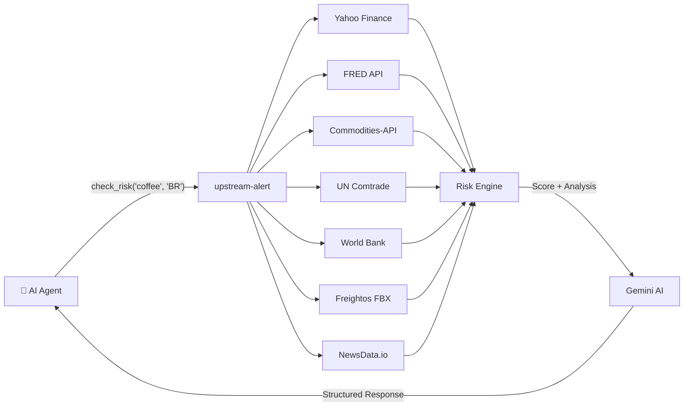

# 🔍 upstream-alert

> **Give your AI agent eyes on the global supply chain.**

[](https://opensource.org/licenses/MIT)
[](https://www.python.org/downloads/)
[](https://pypi.org/project/upstream-alert/)

**upstream-alert** is an AI agent skill that monitors supply chain risks in real-time. It aggregates data from **7 global sources**, scores risk (0–100), and generates AI-powered analysis — all callable as a single tool by your agent.

```
User → "Is it safe to order coffee beans from Brazil right now?"

Agent → [calls upstream-alert]
     → 🟡 Coffee Beans (BR) — Score: 52/100 [MEDIUM]
       📊 CPI pressure moderate at 4.2% YoY.
       ☕ Coffee spot price $5.62/lb (+3.3% MoM).
       🚢 Freight rates down 3.1% — favorable for importers.
       📰 2 disruption signals detected in NewsData feed.
       💡 Recommendation: Proceed with caution, consider hedging.
```

## 🤖 Why Agents Need This

Traditional supply chain monitoring requires humans to check dashboards, read news, and cross-reference data. **upstream-alert** packages all of this into a single function call that any AI agent can invoke.



**What your agent gets back:**
- 📊 **Risk score** (0–100) with severity level
- 📈 **Market pulse** — CPI, freight rates, trade volumes
- 📰 **News signals** — disruption events from global feeds
- 💡 **AI analysis** — context-aware summary & recommendations
- 📡 **Source attribution** — which data sources contributed

## ⚡ Quick Start

### As an AI Agent Skill (Recommended)

<details>
<summary><b>OpenClaw</b> — one command install</summary>

```bash
claw skill install upstream-alert
```

Then just ask your agent:
```
"What's the supply chain risk for semiconductors in Taiwan?"
```
</details>

<details>
<summary><b>Claude Code</b></summary>

```bash
pip install upstream-alert
cp -r skills/claude-code ~/.claude/skills/upstream-alert
export GEMINI_API_KEY="your_key"
```
</details>

<details>
<summary><b>Gemini CLI</b></summary>

```bash
pip install upstream-alert
cp -r skills/gemini ~/.gemini/antigravity/skills/upstream-alert
export GEMINI_API_KEY="your_key"
```
</details>

### As a Python Library

```python
from upstream_alert import check_risk

result = check_risk("coffee", country="BR")
print(result.score)       # 52
print(result.level)       # RiskLevel.MEDIUM
print(result.ai_summary)    # "CPI pressure moderate at 4.2%..."
print(result.sources_used)  # ['fred', 'commodities_api', 'newsdata']
```

### As a CLI Tool

```bash
pip install upstream-alert
export GEMINI_API_KEY="your_key"

upstream-alert check "semiconductor" --country TW
upstream-alert check "rice" --country JP -j    # JSON output
upstream-alert pulse --country US              # Market overview
upstream-alert sources                          # Show configured sources
```

## 🔌 Agent Integration Patterns

### Function Calling / Tool Use

```python
# Define as a tool for any LLM framework
tool_definition = {
    "name": "check_supply_chain_risk",
    "description": "Check supply chain risk for a commodity in a specific country",
    "parameters": {
        "item": {"type": "string", "description": "Commodity name (e.g., 'coffee', '半導體')"},
        "country": {"type": "string", "description": "ISO country code (e.g., 'US', 'TW', 'BR')"}
    }
}

# Implementation
from upstream_alert import check_risk

def check_supply_chain_risk(item: str, country: str) -> dict:
    result = check_risk(item, country=country)
    return {
        "score": result.score,
        "level": result.level.value,
        "summary": result.ai_summary,
        "market_pulse": result.market_pulse.model_dump() if result.market_pulse else None,
        "sources": result.sources_used,
    }
```

> 🚧 **MCP Server** — native MCP tool server integration is on the roadmap.

### Multi-Agent Workflow

```python
from upstream_alert import RiskEngine

# Shared engine for a team of agents
engine = RiskEngine(
    fred_key="...",
    gemini_key="...",
)

# Procurement agent checks before ordering
risk = engine.check("steel", country="CN")
if risk.score > 60:
    # Escalate to human or trigger alternative sourcing
    notify_procurement_team(risk)  # your custom function
```

## 📡 Data Sources

| Source | Key Required | Free Tier | Data | Get Key |
|--------|:---:|-----------|------|:---:|
| **Yahoo Finance** | ❌ | Unlimited | Daily commodity futures (copper, aluminum, soybean, cotton, coffee) | — |
| **World Bank** | ❌ | Unlimited | Economic indicators | — |
| **FRED** | `FRED_API_KEY` | 120 req/min | CPI, PPI, commodity prices | [申請](https://fred.stlouisfed.org/docs/api/api_key.html) |
| **Commodities-API** | `COMMODITIES_API_KEY` | 100 req/month | Real-time commodity prices | [申請](https://commodities-api.com/) |
| **UN Comtrade** | `COMTRADE_API_KEY` | 500 req/day | Trade volumes | [申請](https://comtradeplus.un.org/) |
| **NewsData.io** | `NEWSDATA_API_KEY` | 200 req/day | News + sentiment | [申請](https://newsdata.io/register) |
| **Gemini AI** | `GEMINI_API_KEY` | 15 RPM | AI analysis | [申請](https://aistudio.google.com/apikey) |
| **Freightos FBX** | `FBX_API_KEY` | Paid | Freight rates | [申請](https://terminal.freightos.com/fbx-api/) |

> 💡 **Zero-key start:** Yahoo Finance and World Bank work without any API key. Add `GEMINI_API_KEY` for AI-powered analysis.

## 📦 Supported Item Categories (20 items)

| Category | Examples |
|----------|----------|
| 建材 (Construction) | 鋼筋, 合板, 水泥 |
| 機電 (Electrical) | 電線電纜 |
| 能源 (Energy) | 柴油, 汽油, 天然氣 |
| 食品原料 (Food) | 黃豆, 麵粉, 棕櫚油, 砂糖, 咖啡豆 |
| 電子零件 (Electronics) | 晶片 MCU, 被動元件 |
| 包材 (Packaging) | 瓦楞紙箱, PE 膜 |
| 化工 (Chemicals) | 塑膠粒, 工業酒精 |
| 紡織 (Textiles) | 棉紗, 滌綸纖維 |

## 📊 Risk Scoring

The engine calculates a composite score (0–100) from four weighted signals:

```
Risk Score = (CPI × 0.30) + (News × 0.30) + (Freight × 0.20) + (Trade × 0.20)
```

| Level | Score | Action |
|-------|-------|--------|
| 🟢 Low | 0–39 | Stable — no action needed |
| 🟡 Medium | 40–59 | Monitor — review before large orders |
| 🟠 High | 60–79 | Act — consider alternative sourcing |
| 🔴 Critical | 80–100 | Escalate — immediate attention required |

## 🏗 Architecture

```
upstream-alert/
├── src/upstream_alert/
│   ├── engine.py         ← Orchestration + scoring
│   ├── analyzer.py       ← Gemini AI analysis
│   ├── models.py         ← Pydantic response models
│   ├── cli.py            ← Click CLI interface
│   └── sources/          ← Pluggable data adapters
│       ├── fred.py       ← CPI/PPI/Commodity prices (FRED)
│       ├── commodity.py  ← Real-time prices (Commodities-API)
│       ├── comtrade.py   ← Trade data (UN)
│       ├── worldbank.py  ← Economic indicators
│       ├── newsdata.py   ← News sentiment
│       └── fbx.py        ← Freight rates (Freightos)
├── skills/               ← Pre-built AI agent skills
│   ├── openclaw/         ← OpenClaw skill package
│   ├── claude-code/      ← Claude Code skill
│   └── gemini/           ← Gemini CLI skill
└── tests/                ← 155+ test cases
```

**Design Principles:**
- 🤖 **Agent-first** — designed as a tool for AI agents, not just humans
- 🔑 **BYOK** — bring your own API keys, no vendor lock-in
- 🚫 **No infrastructure** — no database, no cloud services required
- 📦 **Zero dependencies** on system packages — pure Python + HTTP
- 🎯 **Stateless** — every call is independent, perfect for serverless

## 🤝 Contributing

```bash
git clone https://github.com/ImL1s/upstream-alert
cd upstream-alert
pip install -e ".[dev]"
pytest  # 155+ tests
```

## 📄 License

MIT — use freely in personal and commercial projects.
